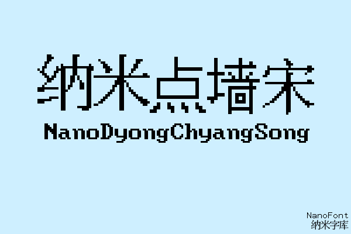
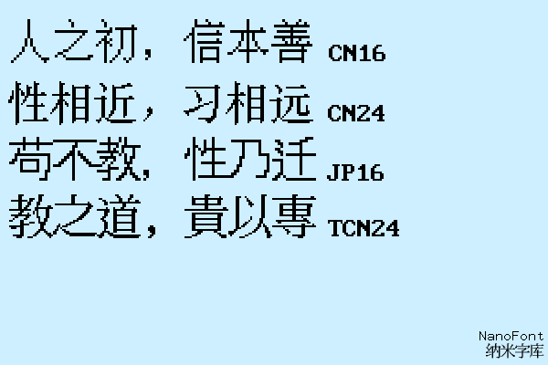

# NanoDyongChyangSong (纳米点墙宋)

## 简介
纳米点墙宋是一个像素字体家族
+ 西文取自hurss字体
+ 中文取自isas的字体包中的bdf文件

## 字体列表
|字体名|称呼|支持编码|
|-|-|-|
|CN16|国标16点阵|GB2312|
|CN24|国标24点阵|GB2312/EUC-KR|
|JP16|日本16点阵|SHIFT-JIS/SJIS-X0213|
|TCN24|繁体（香港、澳门、台湾）24点阵|BIG5|
|JP24|日本24点阵|制作中未发布|
|JP32|日本32点阵|制作中未发布|
|JP48|日本48点阵|制作中未发布|
|TCN16|繁体（香港、澳门、台湾）16点阵|制作中未发布|
|KR16|韩国16点阵|制作中未发布|
|KR24|韩国24点阵|制作中未发布|

## 授权
基于MIT和ISAS的字体文件的授权文件授权
- 免费使用、复制、修改、分发字体
- 不可以为字体收费
- 需要附上同样的授权信息

## 制作人员名单

|单位|名称|来源|
|-|-|-|
|制作者|[**H.S.S. - 寒沙**](https://github.com/Hansha2011/)|Github|

## 联系

QQ: **3582930858**

E-Mail: **3582930858@qq.com**

X: https://x.com/HSS_HACKERSam
